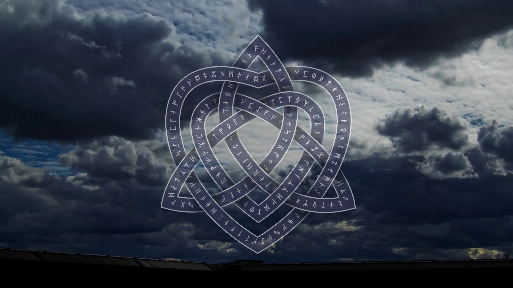

## How to Run the Examples

+ You can either clone the repository using your favorite GitHub client or download the ZIP file from here.
+ Extract the contents of ZIP file to any folder on your computer. All the examples are located in the Examples folder.
+ There is one Solution File in the Project containing C# examples.
+ The projects are created in Visual Studio 2013, but the solution files are compatible with Visual Studio 2010 SP1 and higher.
+ Open the solution file in Visual Studio and build the project.
+ On first run the dependencies will automatically be downloaded via NuGet. This may take some time.
+ Data folder at the root folder of Examples contains input files which CSharp examples used. It is mandatory that you download the Data folder along with the examples project.
+ Open RunExamples.cs file, all the examples are called from here.
+ Uncomment the examples you want to run from within the project.

Please find more details for how to run the examples [here](https://docs.aspose.com/drawing/net/how-to-run-the-examples/).

## Differences of the Showcases

+ The Showcases project has been created in Visual Studio Community 2022, because it uses .NET 7.0.
+ Each showcase will create only one frame, but you can toggle to create hundreds of frames for video files. But rendering of video will take a long time (~15 minutes for CelticHeart showcase).

Separated frames for example:

### CarBody

### CelticHeart

For video only:
+ Firstly, run [`prepare.cmd`](Data/Showcases/prepare.cmd) to create some folders and background frames from videofile.
+ Finally, run `make_video.cmd` and `add_sound.cmd` (optionally, if option `makeVideo` is enabled).

[Home](https://www.aspose.com/) | [Product Page](https://products.aspose.com/drawing/net) | [Docs](https://docs.aspose.com/drawing/net/) | [Demos](https://products.aspose.app/drawing/family) | [API Reference](https://apireference.aspose.com/drawing/net) | [Examples](https://github.com/aspose-drawing/Aspose.Drawing-for-.NET/tree/master/Examples) | [Blog](https://blog.aspose.com/category/drawing/) | [Free Support](https://forum.aspose.com/c/drawing) | [Temporary License](https://purchase.aspose.com/temporary-license)
